# Practica de Maven

Diego Gil

## Lecciones 1 a 16

**1**

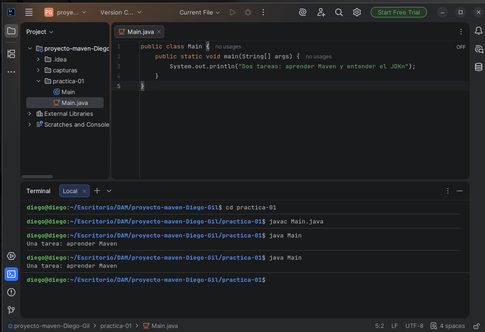

Cambie el texto del programa pero no lo volvi a compilar, y por eso sigue saliendo el mensaje anterior

**2**

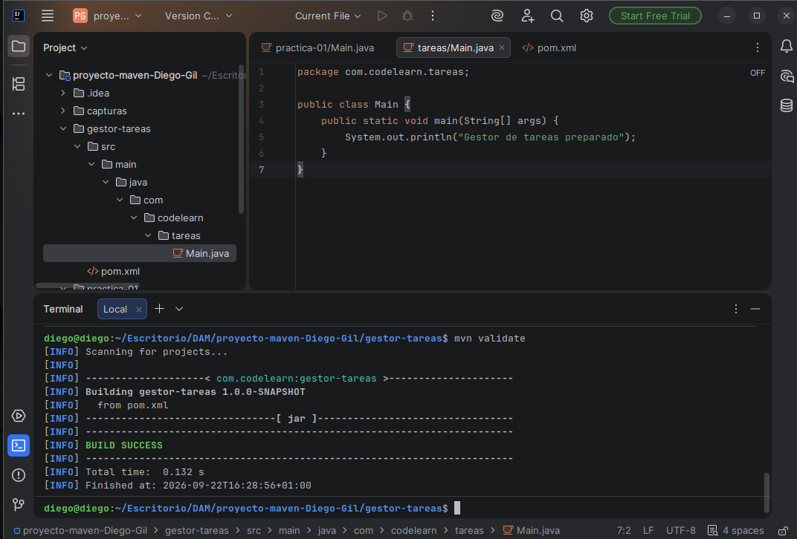

El proyecto ya esta creado con sus carpetas y Maven lo da por correcto

**3**

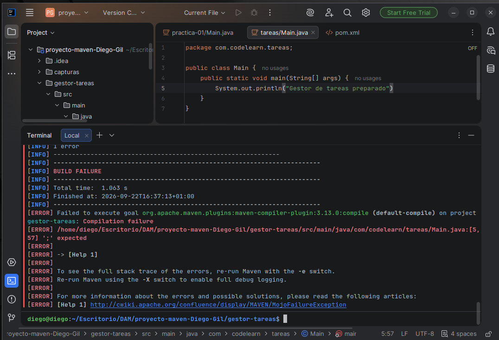

Quite un punto y coma a proposito y Maven indica el archivo y la linea donde esta el fallo

**4**

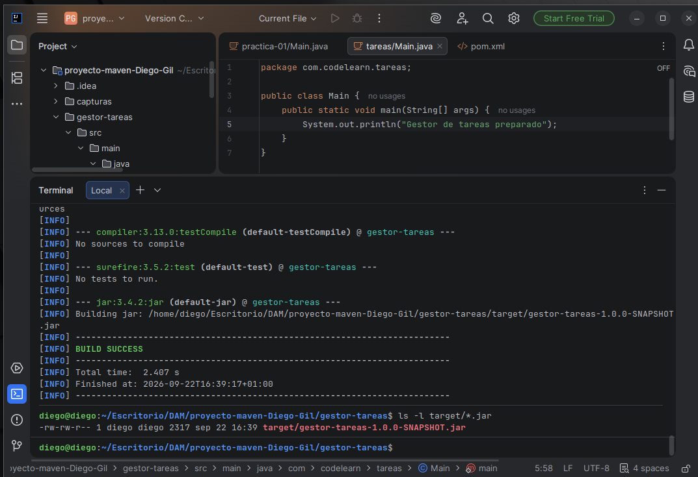

Maven va ejecutando los pasos uno detras de otro hasta crear el archivo final

**5**

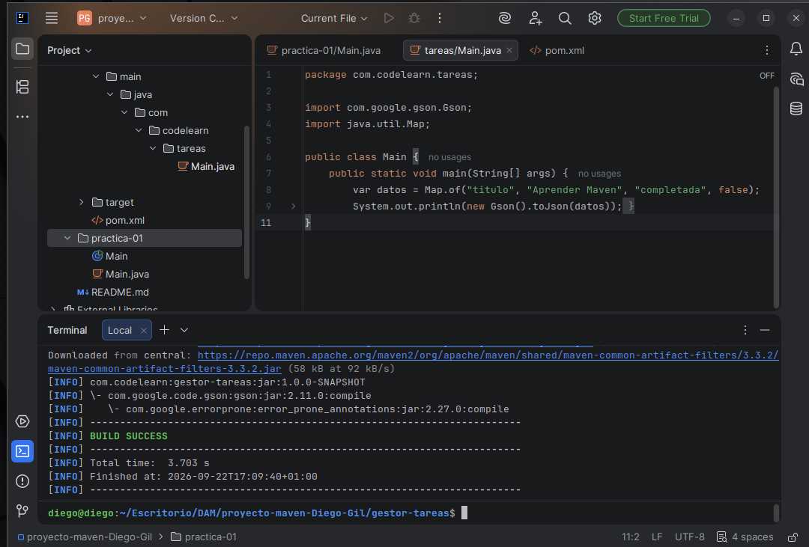

Maven descarga la libreria Gson y la muestra en la lista

**6**

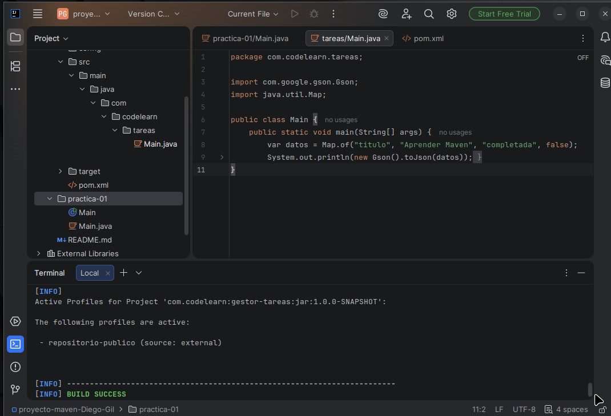

El perfil que puse en el archivo de configuracion aparece como activo

**7**

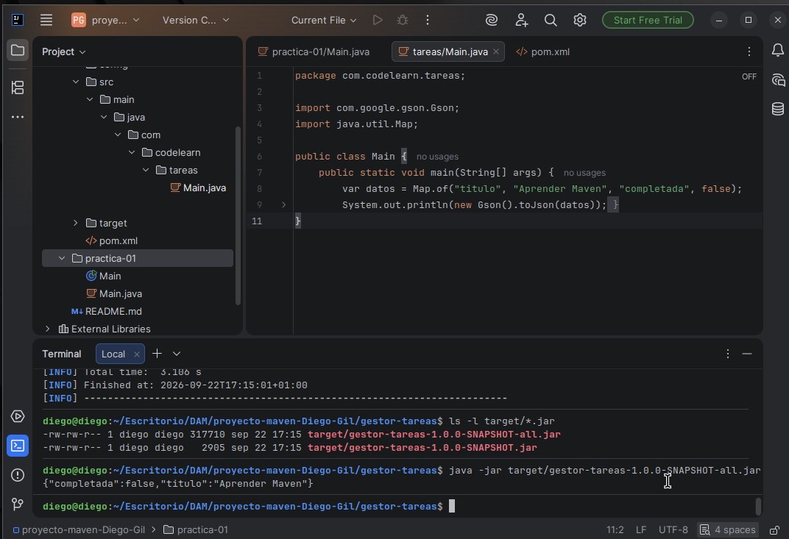

Se crean dos archivos, uno normal y otro que lleva la libreria dentro y funciona solo

**8**

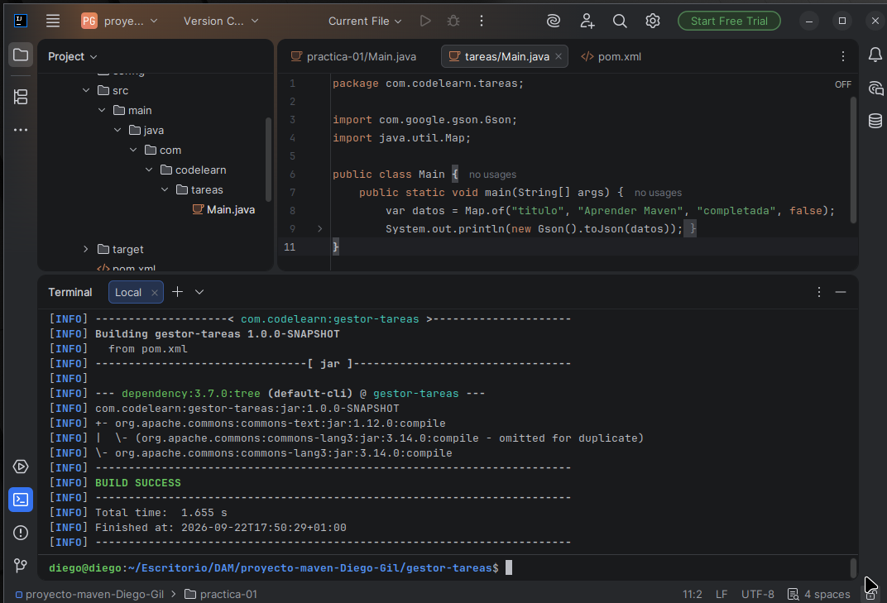

Dos librerias piden lo mismo en versiones distintas y Maven se queda con una

**9**

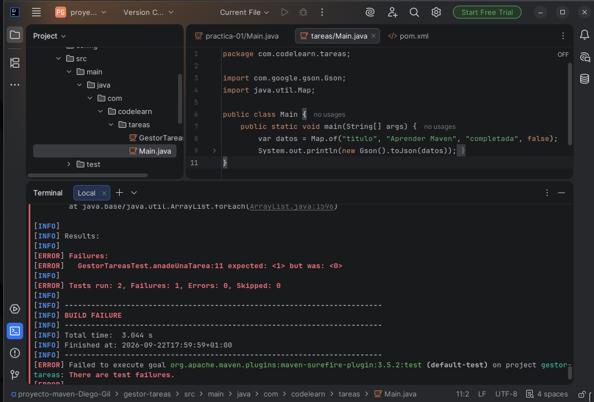

Estropee una prueba a proposito, falla y Maven detiene la construccion

**10**

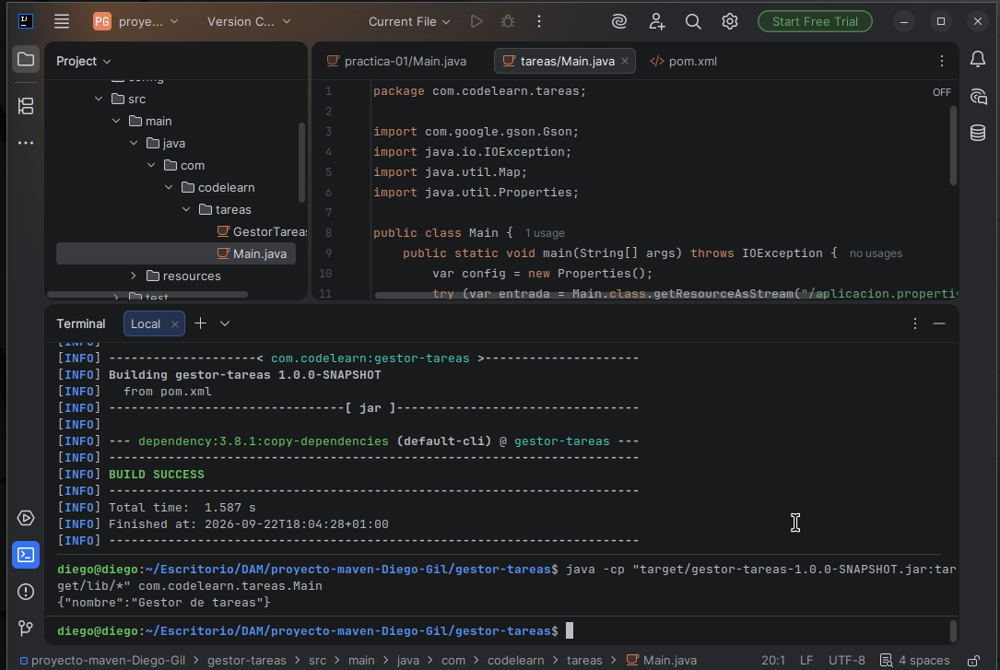

El programa se ejecuta desde la terminal y muestra su resultado

## Practica integradora

El segundo JDK lo instale con `sudo apt install openjdk-17-jdk`

**11**

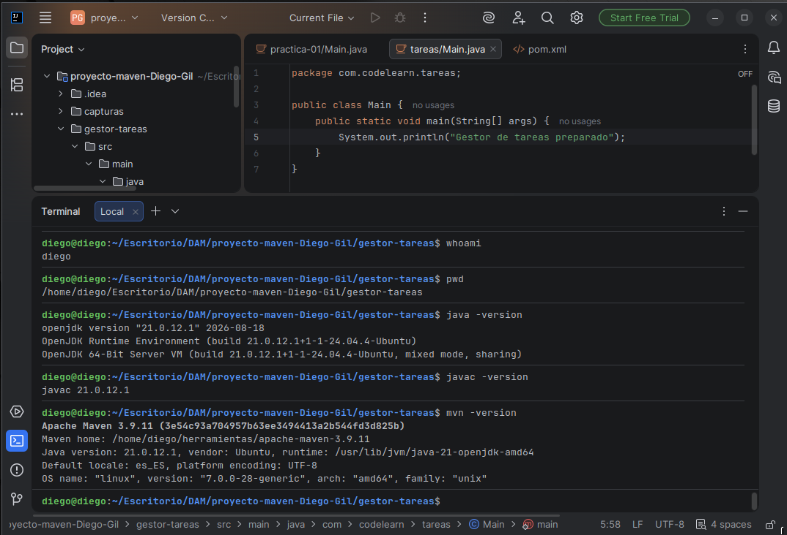

Mi usuario, la carpeta de trabajo y las versiones de Java y Maven instaladas

**12**

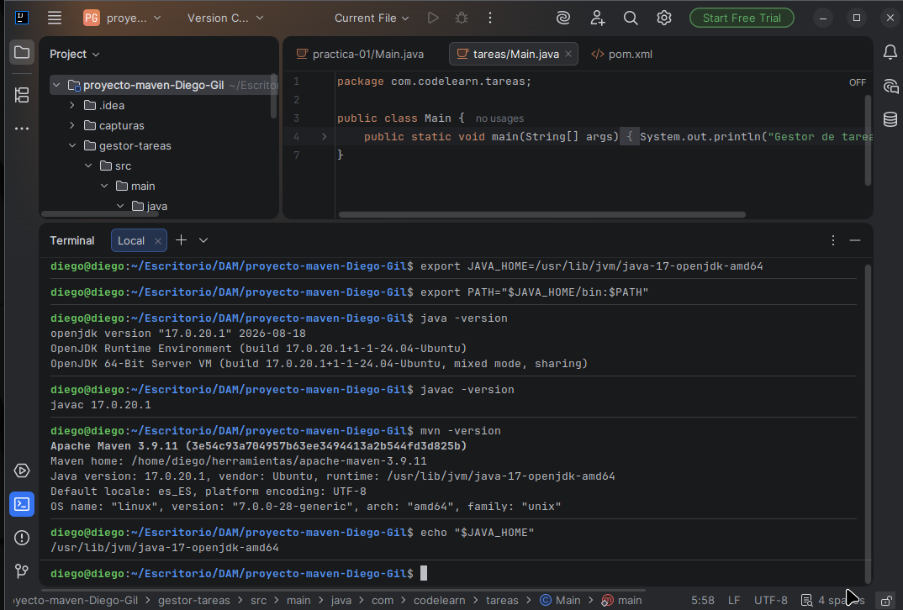

Despues de cambiar a Java 17, las tres herramientas muestran esa version

**13**

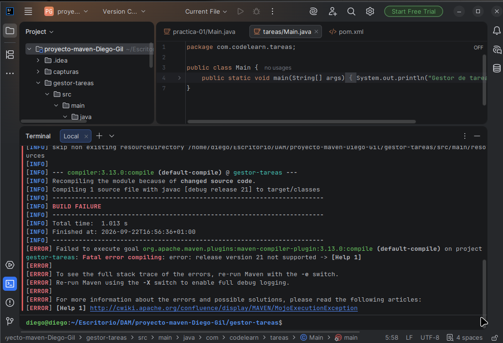

Con Java 17 la construccion falla, porque el proyecto pide Java 21

**14**

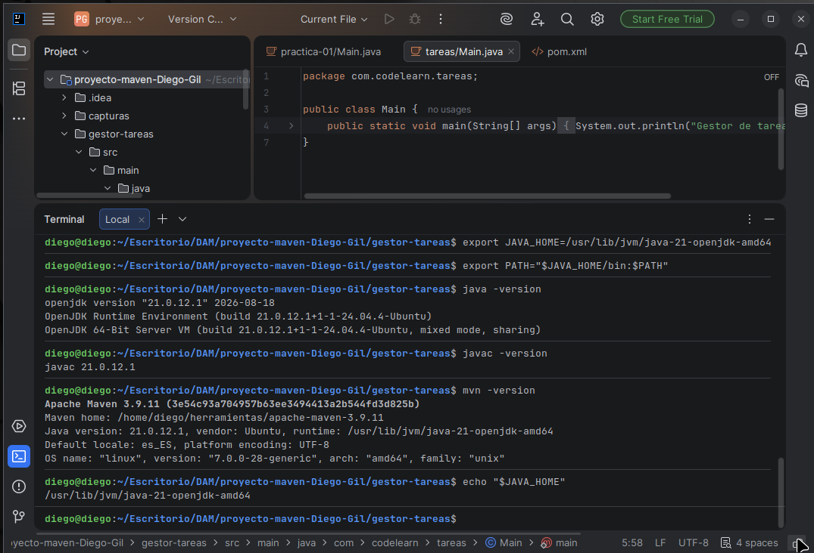

Vuelvo a Java 21 y las herramientas lo confirman

**15**

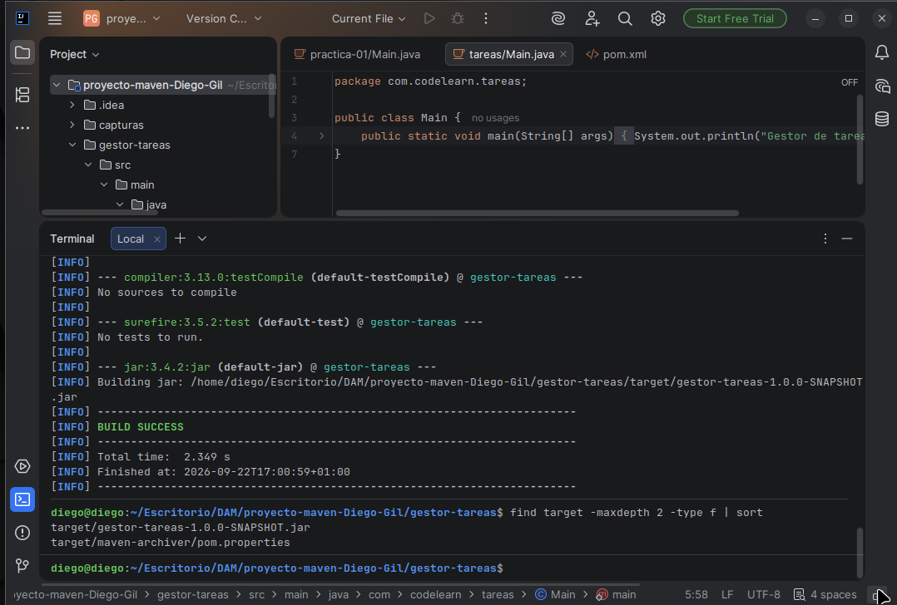

Con Java 21 la construccion termina bien y se genera el archivo
